# Class Diagram

```mermaid
classDiagram
direction LR

%% Domain models
class User["App.Models.User"]
class Borongan["App.Models.Borongan"]
class Laporan["App.Models.Laporan"]
class Penggajian["App.Models.Penggajian"]
class Profile["App.Models.Profile"]
class Shift["App.Models.Shift"]

%% Controller classes. KaryawanDashboardController is in App.Http.Controllers.
class Controller["App.Http.Controllers.Controller"]
class ProfileController["App.Http.Controllers.ProfileController"]
class LoginController["App.Http.Controllers.Auth.LoginController"]
class AdminUserController["App.Http.Controllers.Admin.UserController"]
class AdminShiftController["App.Http.Controllers.Admin.ShiftController"]
class AdminPenggajianController["App.Http.Controllers.Admin.PenggajianController"]
class AdminLaporanController["App.Http.Controllers.Admin.LaporanController"]
class AdminDashboardController["App.Http.Controllers.Admin.DashboardController"]
class AdminBoronganController["App.Http.Controllers.Admin.BoronganController"]
class KaryawanShiftController["App.Http.Controllers.Karyawan.KaryawanShiftController"]
class KaryawanPenggajianController["App.Http.Controllers.Karyawan.KaryawanPenggajianController"]
class KaryawanDashboardController["App.Http.Controllers.KaryawanDashboardController"]
class KaryawanBoronganController["App.Http.Controllers.Karyawan.KaryawanBoronganController"]

%% Framework base classes and traits
class EloquentModel["Illuminate.Database.Eloquent.Model"]
class Authenticatable["Illuminate.Foundation.Auth.User"]
class RoutingController["Illuminate.Routing.Controller"]
class Migration["Illuminate.Database.Migrations.Migration"]
class HasFactory {
	<<trait>>
}
class HasApiTokens {
	<<trait>>
	+tokens() morphMany
}
class Notifiable {
	<<trait>>
}
class AuthorizesRequests {
	<<trait>>
}
class ValidatesRequests {
	<<trait>>
}
class PersonalAccessToken["Laravel.Sanctum.PersonalAccessToken"]
class Tokenable {
	<<polymorphic relation>>
	+tokenable() morphTo
}

%% Each migration file returns an anonymous subclass of Migration.
class MigrationUsers["anonymous: 2014_10_12_000000_create_users_table"] {
	+up()
	+down()
}
class MigrationPasswordResetTokens["anonymous: 2014_10_12_100000_create_password_reset_tokens_table"] {
	+up()
	+down()
}
class MigrationFailedJobs["anonymous: 2019_08_19_000000_create_failed_jobs_table"] {
	+up()
	+down()
}
class MigrationPersonalAccessTokens["anonymous: 2019_12_14_000001_create_personal_access_tokens_table"] {
	+up()
	+down()
}
class MigrationProfiles["anonymous: 2026_09_23_165037_create_profiles_table"] {
	+up()
	+down()
}
class MigrationShifts["anonymous: 2026_09_23_165053_create_shifts_table"] {
	+up()
	+down()
}
class MigrationBorongans["anonymous: 2026_09_23_165134_create_borongans_table"] {
	+up()
	+down()
}
class MigrationPenggajians["anonymous: 2026_09_23_165157_create_penggajians_table"] {
	+up()
	+down()
}
class MigrationLaporans["anonymous: 2026_09_23_165211_create_laporans_table"] {
	+up()
	+down()
}

%% PHP inheritance
User --|> Authenticatable
Borongan --|> EloquentModel
Laporan --|> EloquentModel
Penggajian --|> EloquentModel
Profile --|> EloquentModel
Shift --|> EloquentModel
Controller --|> RoutingController
ProfileController --|> Controller
LoginController --|> Controller
AdminUserController --|> Controller
AdminShiftController --|> Controller
AdminPenggajianController --|> Controller
AdminLaporanController --|> Controller
AdminDashboardController --|> Controller
AdminBoronganController --|> Controller
KaryawanShiftController --|> Controller
KaryawanPenggajianController --|> Controller
KaryawanDashboardController --|> Controller
KaryawanBoronganController --|> Controller
MigrationUsers --|> Migration
MigrationPasswordResetTokens --|> Migration
MigrationFailedJobs --|> Migration
MigrationPersonalAccessTokens --|> Migration
MigrationProfiles --|> Migration
MigrationShifts --|> Migration
MigrationBorongans --|> Migration
MigrationPenggajians --|> Migration
MigrationLaporans --|> Migration

%% Trait use
Borongan ..> HasFactory : use
Laporan ..> HasFactory : use
Penggajian ..> HasFactory : use
Profile ..> HasFactory : use
Shift ..> HasFactory : use
User ..> HasApiTokens : use
User ..> HasFactory : use
User ..> Notifiable : use
Controller ..> AuthorizesRequests : use
Controller ..> ValidatesRequests : use

%% Eloquent relations; migrations confirm cascade delete for these foreign keys.
User "1" *-- "0..*" Borongan : hasMany / belongsTo
User "1" *-- "0..*" Penggajian : hasMany / belongsTo
User "1" *-- "0..*" Shift : hasMany / belongsTo
User "1" *-- "0..*" Profile : hasOne / belongsTo

%% Sanctum token relations are polymorphic and use tokenable_type/tokenable_id.
User "1" o-- "0..*" PersonalAccessToken : tokens() morphMany
PersonalAccessToken ..> Tokenable : tokenable() morphTo
```

Nama berawalan `Migration` pada diagram adalah alias untuk sembilan kelas anonymous yang dikembalikan file migration, bukan nama kelas PHP yang dideklarasikan. Relasi model bisnis di atas berasal dari method pada model; kolom foreign key `user_id` pada migration profiles, shifts, borongans, dan penggajians semuanya menggunakan cascade delete. Migration profiles tidak membuat `user_id` unique, sehingga database sendiri tidak membatasi satu profile per user meskipun model mendefinisikan `hasOne`.

Migration juga membuat tabel `password_reset_tokens` dan `failed_jobs`, tanpa model Eloquent atau class domain tambahan di folder yang discan. Tabel `personal_access_tokens` memakai kolom polymorphic `tokenable`; `HasApiTokens` dan model token berasal dari Laravel Sanctum.